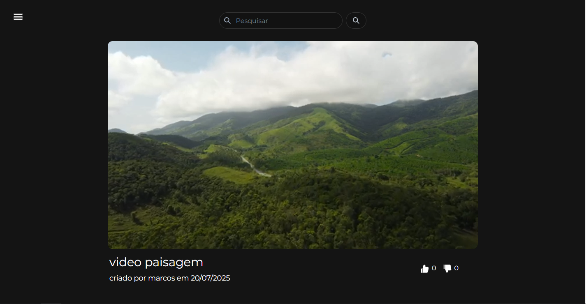
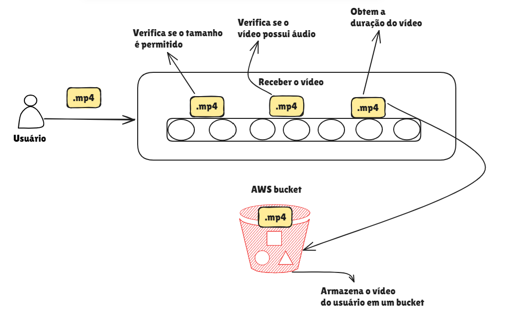
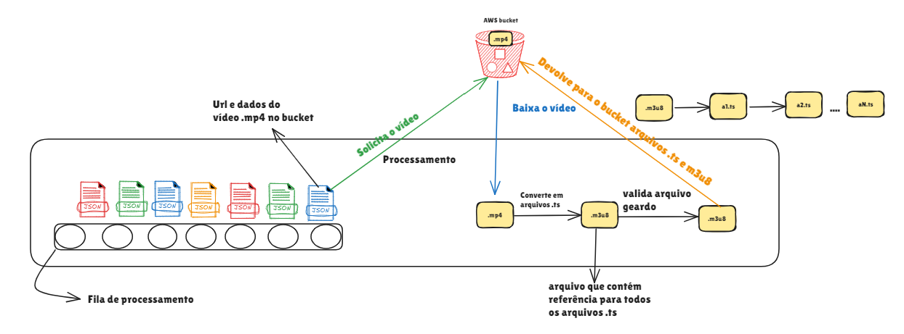
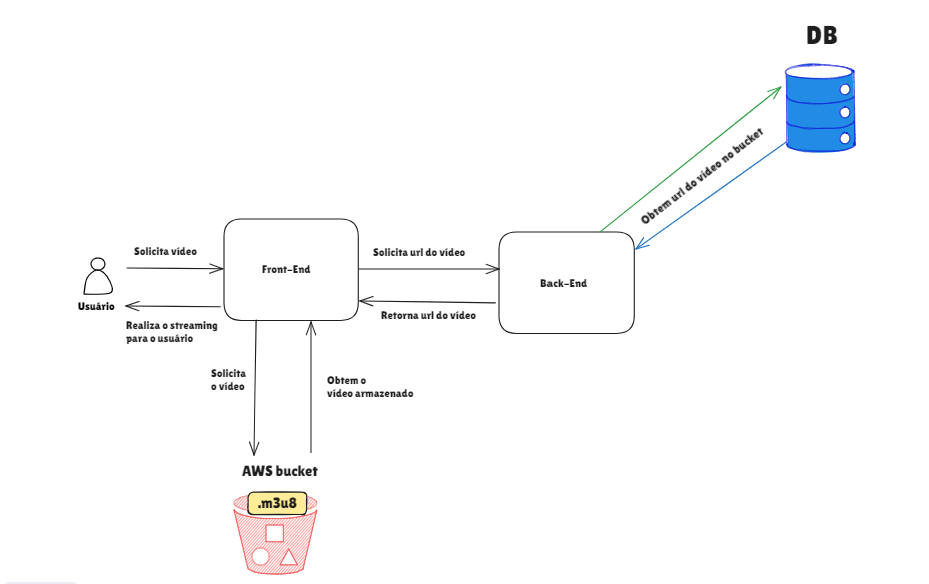
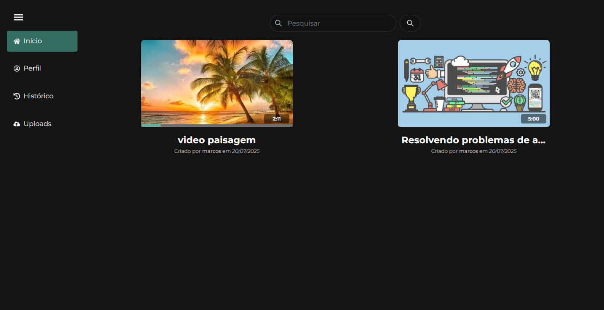
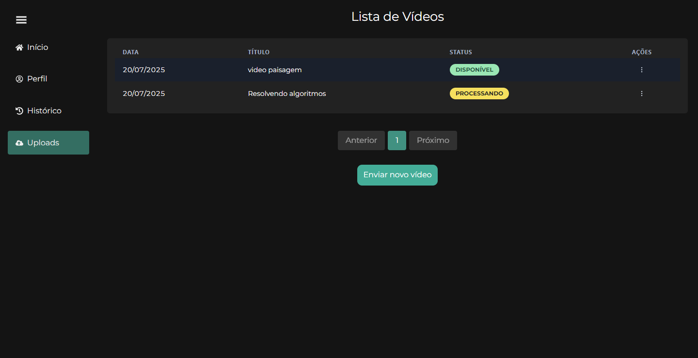
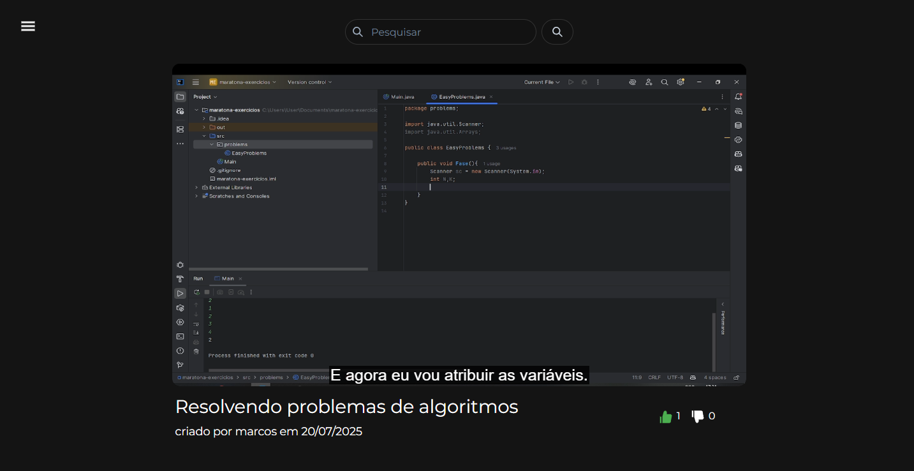

# Projeto stream de vídeos

### O projeto tem como objetivo realizar o stream de um vídeo em mp4 enviado por um usuário

## Como funciona?
### Fase 1

### Fase 2

### Fase 3

## Tecnologias utilizadas

- FastApi(Python)
- Minio(bucket local)
- RabbitMQ
- MySql
- React(javaScript)
- Api Gemini
- ffmpeg

## Imagens da aplicação

### Tela inicial

### Tela videos cadastrados

## Geração de legendas
### A api go google gemini foi utilizada para geração de legendas de um vídeo, o áudio é extraido utilizando o `ffmpeg` e enviado para o google gemini para geração da legenda em formato `.vtt`, posteriormente utilizando a url da legenda no atributo `src` da tag `track` para exibição.
